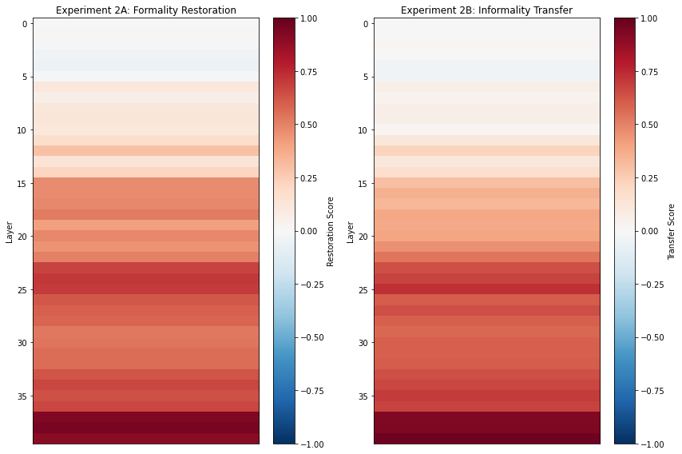

# LLM Hallucinations: An Internal Tug of War

## TL;DR

LLM hallucination isn’t just a random error, but a result of two or more competing processes within the model: an internal **tug of war**. My work suggests that even when a model knows it should be uncertain, another drive can take over and lead to a confident response. This shows that hallucination is not a failure of knowledge but a policy failure. This is a direct, causal, explanation for the “incentivized guessing” phenomenon in [the concurrent Open AI work](https://arxiv.org/abs/2509.04664). By mechanistically investigating [Llama-2-13b-chat](https://huggingface.co/meta-llama/Llama-2-13b-chat), I located this war within a specific model region where both confident hallucination and user representation are deeply intertwined. This reframes LLM hallucination from a vague statistical issue to a tangible engineering one, opening a completely new path to fixing hallucinations from the inside out.

## Table of Contents

- [LLM Hallucinations: An Internal Tug of War](#llm-hallucinations-an-internal-tug-of-war)
  - [TL;DR](#tldr)
  - [Table of Contents](#table-of-contents)
  - [The Hunt for a Ghost](#the-hunt-for-a-ghost)
  - [Part 1: The Unexpected Clue - A Behavioral Asymmetry](#part-1-the-unexpected-clue---a-behavioral-asymmetry)
  - [Part 2: The Investigation - Locating the Causal Mechanism](#part-2-the-investigation---locating-the-causal-mechanism)
  - [Part 3: The Control - Is It a ‘Confidence’ or a ‘Style’ Hub?](#part-3-the-control---is-it-a-confidence-or-a-style-hub)
  - [Part 4: Connecting the Dots - The Internal Tug of War](#part-4-connecting-the-dots---the-internal-tug-of-war)
  - [A Final Thought: The Accidental Detective](#a-final-thought-the-accidental-detective)
  - [Future work](#future-work)
  - [Appendix: Notes from the Field](#appendix-notes-from-the-field)
 
#### Last updated at Oct 2, 2025

## The Hunt for a Ghost

We all know the feeling. You’re talking to a chatbot, and yet it says completely false things but sounds like an absolute expert on the topic, whether it’s about Golden Gate Bridge or your dog’s birthday. LLM hallucination poses a major blocker and a key challenge to deploy AI, especially in domains like medicine and law, where it can bring revolutionary change. Why does LLM hallucinate and how? Why more computation doesn’t help and even worsen hallucinations? Given we know very little of LLM’s inner workings, could answers to these questions come out as a total surprise, completely overturning all our existing assumptions?

I didn’t set out to find this ghost in the machine. My project began as an investigation into LLM’s capabilities to form knowledge about its human user. The turning point happened when I noticed a gap between a strong internal signal and a weak external behavior. I realized my experiment results had accidentally uncovered something else, something more fundamental. In an unexpected case of scientific convergence, my work revealed this internal “tug of war” just five days before OpenAI published their influential work on LLM hallucination "Why Language Models Hallucinate". Their work provided a powerful behavioral explanation for what the model is doing; my work, by accident, was uncovering the physical mechanism for how it does it. 

This is the story of that investigation.

## Part 1: The Unexpected Clue - A Behavioral Asymmetry

My initial goal was to understand how Llama-2-13b-chat-hf adapts to a user's epistemic status (certain vs uncertain). I created a simple behavior experiment: give the model a series of prompts where the user is either "certain" or "uncertain" about a fact, and see if the model mirrors their style. 

The results were not what I expected. The model was near-perfect and highly reliably at mirroring user’s certainty, adopting a declarative style 97.5% of the time. But as a contrast, when the user was uncertain, the model only adopted a tentative style 57.5% of the time. In the rest 42.5% of cases, the model defaulted back to a confident response. 

This wasn't just noise; it was statistically significant (p value is 0). The model seemed to have a powerful internal drive to pull it back towards confidence. 

## Part 2: The Investigation - Locating the Causal Mechanism

I used a mechanistic interpretability technique: activation patching, a form of causal analysis where you replace activations from one model run with another to see which model components are **sufficient** to restore a behavior. 
I ran two opposing patching experiments on the user's epistemic status (certain vs uncertain). Given the behavioral asymmetry, I thought I’d find these two as separate circuits: 
- A **denoising** run: find the components **sufficient** to restore certainty
- A **noising** run: find the components **necessary** to induce uncertainty

The results were shocking: the exact same layers are responsible for both restoring certainty (with a perfect 1.0 score) and inducing uncertainty (with a strong 0.9 score).This suggests a tug of war happening within a shared, centralized circuit that powerfully controls the entire axis of certainty, and it’s biased towards confidence.

What made this discovery more compelling was its strong overlaps with prior work, which had independently identified layers 20-30 in this same model as being critical for inferring user demographics.This convergence of evidence—showing the same region handles both epistemic and demographic traits—strongly confirms that confident hallucination and user representation are deeply intertwined.

This led to the next crucial question: how general is this hub? Is it primarily about confidence, or is it a more generic "style" circuit?

## Part 3: The Control - Is It a ‘Confidence’ or a ‘Style’ Hub?

To test the specificity of the hub, I designed a control experiment that was methodologically identical but aiming at a completely different stylistic axis: formality (formal vs informal), looking for the components that could restore a formal vs informal style. The results found the high-impact layers for formality in the same 20 layers (40 layers in total).

However, the heatmap revealed a crucial distinction. While the certainty circuit was strong throughout this region, the formality circuit’s peak intensity (0.9 scores) was concentrated in the very final layers (37-39). And Layer 39 stands out as the epicenter, scoring: 1.0 for certainty, 0.9 for uncertainty, 0.9 for formality and 0.9 for informality. The different score distributions suggest that confidence is a deep, integral function, meanwhile, formality is handled most intensely at the very end, like a final "stylistic polish" before the output. 

This raises a question for future work: is a late-layer component like Layer 39 the most powerful arbiter for these traits, or is it more of a "press office" simply delivering a decision made earlier?

## Part 4: Connecting the Dots - The Internal Tug of War

This is where all the pieces connect. Our experiments revealed a paradox: the model has a strong internal circuit for uncertainty (with a 0.9 score), so why does it only behave uncertainly 57.5% of the time?

The evidence points to an internal **tug of war**. While the User Modeling Hub can represent uncertainty, it's fighting a battle against a stronger, systemic confidence bias—a bias we measured mechanistically in the circuit's asymmetric scores (1.0 for certainty vs. 0.9 for uncertainty).

This provides a direct, causal explanation for OpenAI's "incentivized guessing," framing confident hallucination not as a knowledge failure, but as a policy failure where the model's default to confidence overpowers its more truthful internal state.

## A Final Thought: The Accidental Detective

This project’s journey from a simple user-modeling query to a deep dive into hallucination’s roots feels like a full circle. My initial fascination with this domain began with a simple, accidental discovery. I used to ask LLMs to tell me something I didn’t know, and accidentally I found: the models, just like Sherlock Holmes, could efficiently infer a user's demographic, psychological, and even cognitive traits from unrelated conversations. It was this startling ability to "read" its user that first convinced me that a rich, complex user model must exist within the machine.

## Future work

While this research provides a causal explanation for a specific type of hallucination, the next step is to rigorously test and even try to disconfirm this hypothesis to ensure its robustness.

### Phrase 1. Validation and Generalization (Near-Term)

To test the robustness and generality of the "User Modeling Hub" finding:

- replicate these experiments across different model families and scales to determine if this is a universal feature of instruction-tuned LLMs.
- compare base models to their RLHF-tuned versions to isolate where in the training process the powerful confidence bias is introduced.

### Phrase 2. Deeper Mechanistic Understanding (Mid-Term)

The focus will shift to creating a detailed map of its internal wiring, especially for key layers like layer 39, identified in the previous experiemnts:
- use more fine-grained techniques like path patching to understand how specific components feed information into the hub and interact within it.
- use tools like sparse autoencoders to isolate and analyze the specific "confidence neurons" or features at the heart of the circuit.

### Phrase 3. Intervention and Mitigation(Long-Term)

The ultimate goal is to engineer a solution. This phase will test direct, circuit-level interventions to make the model safe:

- design experiments to "rebalance" the tug of war during inference, such as by amplifying the uncertainty signal or partially ablating the components responsible for the confidence bias.
- the key objective is to causally reduce the rate of confident hallucination on a benchmark dataset without significantly harming the model’s overall performance.

## Appendix: Notes from the Field

For me, this project was an adventure full of unexpected, exciting turns. With the project due in just 10 hours, I made the high-stakes decision to abandon my initial experiments on a smaller 2B model and pivot entirely to the 13B model. The smaller model’s behavior experiment results didn’t really excite me, which can be hard to describe why. I also knew prior work on user modeling had used the 13B model, raising the possibility of validating my findings against theirs.

This decision kicked off a sprint through a minefield of technical failures. It required pivoting from Colab (which failed with memory crashes across all subscription tiers), to RunPod (with trials on 3-4 different GPUs), and finally to Lambda. Even then, eventually I was forced to let go of high-level libraries, instead I went for a raw PyTorch implementation. Thankfully it worked! 
